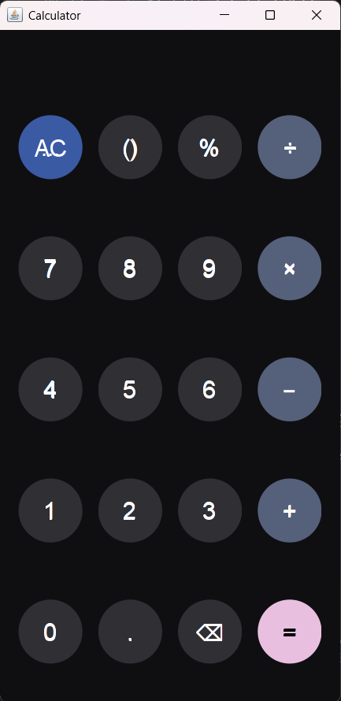
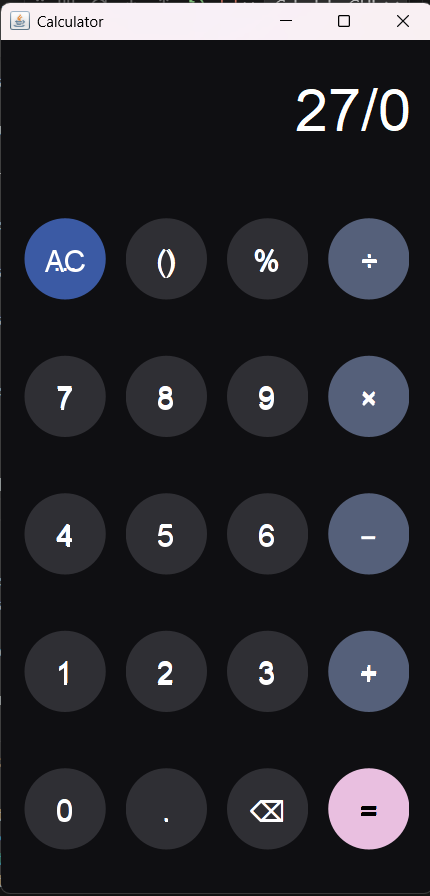
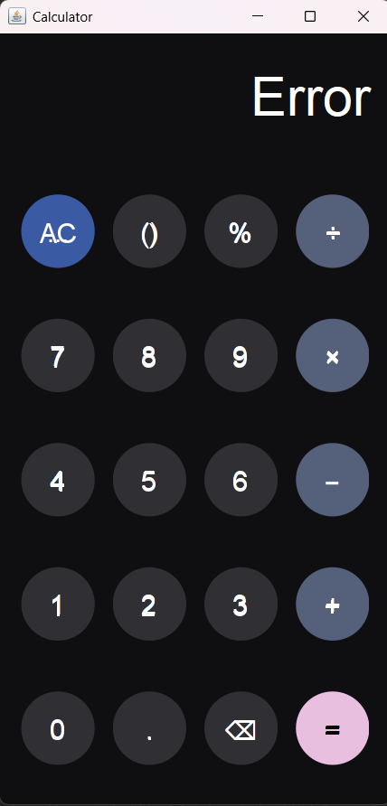

Simple Java Calculator Project

Hey! This is the documentation for a simple calculator I built in Java. It's got two modes: a basic command line version and a cooler graphical one using Swing.

Features I Included
This project is split up into a few parts to keep things clean:

Calculator.java (The Math Engine): This is the core logic that handles the four main operations (+, -, *, /) using float for the numbers.

Command Line Interface (CLI): Handled by CalculatorApp.java.

It gives you a text-based menu when you run it.

I added input validation to make sure you can only enter valid numbers or menu choices.

It also handles the classic "Division by Zero" error so the program doesn't crash!

Graphical User Interface (GUI): This is CalculatorGUI.java (plus a cool custom button class).

It has a dark, modern design using Java Swing.

Screenshots
Here are some screenshots of the GUI in action:

MMain window upon launch ()

Example calculation with result ()

Error handling (invalid input) dialog ()

 How to Get It Running
You need to have Java installed (JDK 8 or newer) to compile and run this.

1. File Setup
The whole program is in the code block above, but for Java to compile it right, you should save the code into three separate files:

Calculator.java: For the basic add, subtract, etc. methods.

CalculatorApp.java: The main class that runs the CLI version.

CalculatorGUI.java: The class for the graphical window and the RoundButton logic.

2. Compile Everything
Open your terminal or command prompt in the directory where you saved the files and run this command:

Bash

javac *.java
3. Run the App!
You've got two choices now:

A. Run the CLI (Command Line)
This is the default text-based version.

Bash

java CalculatorApp
B. Run the GUI (Graphical Interface)
To see the cool dark-themed calculator, you have to pass the gui argument:

Bash

java CalculatorApp gui
 Code Breakdown
Here’s a quick overview of what each main file/class does:

Calculator.java: Just four simple methods to handle addition, subtraction, multiplication, and division. It uses float for decimal numbers.

CalculatorApp.java: This contains the main method that decides which interface to launch. It also has helper functions like getValidChoice and getValidFloat to make sure the user enters sane input in the console.

CalculatorGUI.java:

initComponents(): Sets up the look and feel, colors, and button grid.

evaluateExpression(String expr): This is the heavy lifting! It tokenizes the expression and uses two stacks to solve the equation in the correct order.

RoundButton: A little piece of custom Swing code to draw circular buttons instead of the default square ones.